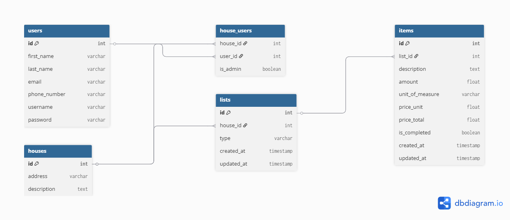

# ListAqui App

Uma aplicação web full stack para gerenciar listas de compras de forma colaborativa entre os membros de uma casa.

---

## Modelo de Dados

### Entidades e Seus Atributos:

**Tabela `users`**:
* `id` (inteiro, chave primária)
* `first_name` (texto)
* `last_name` (texto)
* `email` (texto, único)
* `phone_number` (texto)
* `username` (texto, único)
* `password` (texto, hash)

**Tabela `houses`**:
* `id` (inteiro, chave primária)
* `address` (texto)
* `description` (texto)

**Tabela `house_users` (tabela de ligação)**:
* `house_id` (inteiro, chave estrangeira para `houses`)
* `user_id` (inteiro, chave estrangeira para `users`)
* `is_admin` (booleano)

**Tabela `lists`**:
* `id` (inteiro, chave primária)
* `house_id` (inteiro, chave estrangeira para `houses`)
* `type` (texto, e.g., 'urgente', 'mensal')
* `created_at` (timestamp)
* `updated_at` (timestamp)

**Tabela `items`**:
* `id` (inteiro, chave primária)
* `list_id` (inteiro, chave estrangeira para `lists`)
* `description` (texto)
* `amount` (número)
* `unit_of_measure` (texto, e.g., 'kg', 'litro', 'unidade')
* `price_unit` (número, opcional)
* `price_total` (número, opcional)
* `is_completed` (booleano, `false` por padrão)
* `created_at` (timestamp)
* `updated_at` (timestamp)

### Diagrama de Entidade-Relacionamento

Abaixo, a representação visual do nosso modelo de dados:

